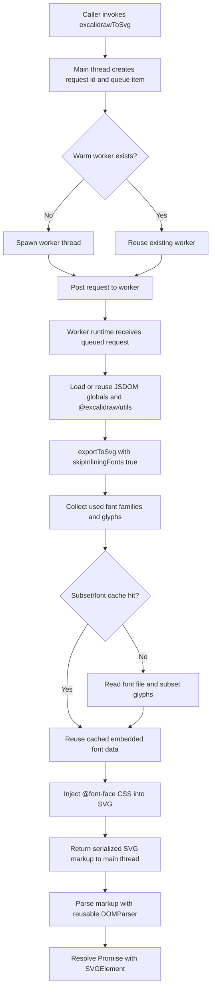

# Excalidraw to SVG

Node.js library to convert Excalidraw diagrams into standalone SVGs with embedded fonts.
Useful if you are storing Excalidraw diagrams in repos and want a pipeline to export them, or need server-side SVG rendering.

> **Note:** This is a Node.js library. If you want to export SVGs in a web app, use the [@excalidraw/utils](https://www.npmjs.com/package/@excalidraw/utils) library directly.

## Features

- **CLI & API** — Use from the command line or as a library in your Node.js project.
- **Embedded fonts** — Excalidraw's custom fonts (Excalifont, Virgil, Cascadia, Comic Shanns, Liberation Sans, Lilita One, Nunito) are automatically detected and embedded as base64 `@font-face` rules, so SVGs render correctly without external font dependencies.
- **Isolated runtime** — Uses JSDOM inside a worker thread so `@excalidraw/utils` can run in Node.js without mutating your app's global `window`, `document`, `fetch`, or other browser APIs.
- **Warm worker architecture** — Reuses a single worker across back-to-back exports so Excalidraw, JSDOM, and font tooling stay hot instead of paying cold-start cost on every call.
- **Font caching** — Caches font file reads and subset results inside the worker to speed up repeated exports with the same fonts and glyph sets.
- **Timeout and abort support** — Supports `timeoutMs` and `AbortSignal`, and terminates the worker thread if an active export times out or is aborted.
- **String or Object input** — Pass in a raw JSON string or a parsed JavaScript object.

## Installation

```bash
npm install @aldinokemal2104/excalidraw-to-svg
```

## Usage

### CLI

You can run this package as a CLI tool via `npx` (or as a locally installed dependency). It takes two arguments: the path to the `.excalidraw` file and an optional output path (file or directory).

```bash
# Output to the same directory as the input (replaces .excalidraw with .svg)
npx @aldinokemal2104/excalidraw-to-svg ./diagrams/example.excalidraw

# Output to a specific directory
npx @aldinokemal2104/excalidraw-to-svg ./diagrams/example.excalidraw ./output

# Output to a specific file
npx @aldinokemal2104/excalidraw-to-svg ./diagrams/example.excalidraw ./output/my-diagram.svg
```

### API

Install the package as a dependency and call the exported function with an Excalidraw JSON object or string. The function returns a **DOM `SVGElement`** — use `.outerHTML` to get the string representation.

```javascript
const excalidrawToSvg = require("@aldinokemal2104/excalidraw-to-svg");

const diagram = {
  type: "excalidraw",
  version: 2,
  source: "https://excalidraw.com",
  elements: [
    {
      id: "vWrqOAfkind2qcm7LDAGZ",
      type: "ellipse",
      x: 414,
      y: 237,
      width: 214,
      height: 214,
      angle: 0,
      strokeColor: "#000000",
      backgroundColor: "#15aabf",
      fillStyle: "hachure",
      strokeWidth: 1,
      strokeStyle: "solid",
      roughness: 1,
      opacity: 100,
      groupIds: [],
      strokeSharpness: "sharp",
      seed: 1041657908,
      version: 120,
      versionNonce: 1188004276,
      isDeleted: false,
      boundElementIds: null,
    },
  ],
  appState: {
    viewBackgroundColor: "#ffffff",
    gridSize: null,
  },
};

const svgElement = await excalidrawToSvg(diagram);
console.log(svgElement.outerHTML);
```

You can also pass a raw JSON string:

```javascript
const fs = require("fs");
const excalidrawToSvg = require("@aldinokemal2104/excalidraw-to-svg");

const json = fs.readFileSync("./diagrams/example.excalidraw", "utf8");
const svgElement = await excalidrawToSvg(json);
console.log(svgElement.outerHTML);
```

You can optionally enforce a timeout or cancel an in-flight export:

```javascript
const controller = new AbortController();

const svgElement = await excalidrawToSvg(diagram, {
  timeoutMs: 30_000,
  signal: controller.signal,
});
```

## How It Works

### Architecture Summary

1. **Public API call** — `excalidrawToSvg(diagram, options)` enqueues a request in the main thread.
2. **Warm worker reuse** — A single worker is reused for sequential exports, so the Excalidraw runtime, JSDOM polyfills, and `subset-font` initialization stay hot between calls.
3. **Queued execution** — Only one export runs at a time inside the worker. Additional calls wait in a queue until the active export finishes.
4. **Runtime export** — Inside the worker, `@excalidraw/utils` renders the SVG with `skipInliningFonts: true`.
5. **Font embedding with caches** — The worker scans used fonts, reads font files from disk once, caches subset results by `font + glyph set`, and injects `@font-face` rules into the SVG.
6. **Main-thread parse** — The worker returns serialized SVG markup, and the main thread parses it back into a DOM `SVGElement`.
7. **Idle cleanup** — If there is no more work queued, the warm worker is automatically torn down on the next idle tick.

### Mermaid Diagram



### Timeout and Cancellation Behavior

- **Queued request timeout/abort** — If a request has not started yet, it is removed from the queue and never sent to the worker.
- **Active request timeout/abort** — If a request is already rendering, the promise rejects and the worker thread is terminated.
- **No overlap after timeout** — The next queued export does not start until the old worker's `terminate()` promise resolves, so a timed-out render is not left running in the background.
- **Process isolation** — Because cancellation happens by terminating the worker thread, CPU and memory used by the in-flight render are released with that worker rather than left attached to the main process.

## Development

### Prerequisites

- Node.js (with `--experimental-vm-modules` support for tests)

### Running Tests

```bash
npm test
```

### Publishing to npm

This package is configured to publish from GitHub Actions using npm Trusted Publisher with provenance.

1. Bump the version in `package.json` (or use `npm version patch` / `npm version minor`).
2. Push your changes to GitHub.
3. Run the publish workflow from the Actions tab.

If you need a manual fallback publish, you can still use an npm token:

```bash
NPM_TOKEN=your_npm_token_here npm run npm:publish
```

The manual command automatically runs tests, authenticates with npm, publishes the package with public access, and cleans up the auth file afterward.

### Project Structure

```
src/
├── excalidraw-to-svg.js       # Public API, warm worker queue, timeout/abort handling, SVG parsing
├── excalidraw-runtime.js      # Worker runtime: JSDOM, Excalidraw export, font embedding, caching
├── excalidraw-to-svg.worker.js # Worker thread entry point and in-worker render queue
├── build-svg-path.js          # Output path resolution for CLI
├── build-svg-path.test.js     # Tests for path resolution
├── excalidraw-to-svg.test.js  # Tests for SVG conversion, worker reuse, timeout safety
├── cli.js                     # CLI entry point
└── index.js                   # Package entry point (re-exports core)
diagrams/                      # Example .excalidraw files
```

## Dependencies

- [`@excalidraw/utils`](https://www.npmjs.com/package/@excalidraw/utils) — Excalidraw's official export utilities
- [`jsdom`](https://www.npmjs.com/package/jsdom) — Browser environment simulation used inside the isolated worker runtime
- [`subset-font`](https://www.npmjs.com/package/subset-font) — Font subsetting to keep embedded SVG fonts small

## License

MIT
